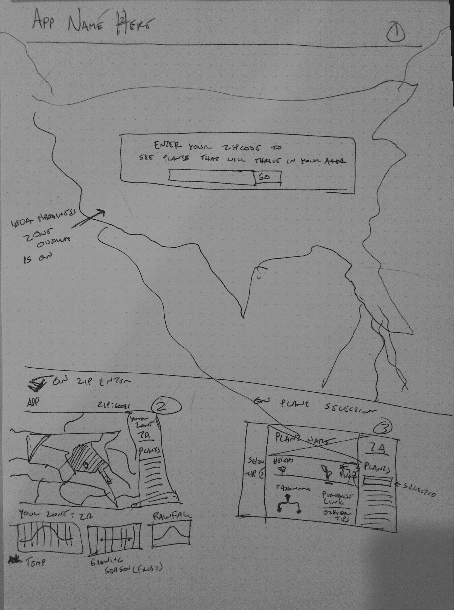

# Project Proposal 2, Gus Wezerek

#### Background and Motivation. Discuss your motivations and reasons for choosing this project, especially any background or research interests that may have influenced your decision.
My boyfriend and I briefly got into the trading card game Magic: The Gathering (MTG) last year. While I eventually became very familiar with the mechanics and metagame surrounding the Theros block, which was the current set of cards at the time, I always wondered about how the game had evolved to that point, given that it was almost as old as I was. I became more interested after attending an all-day event where we were given packs from many different sets throughout Magic's history and played against decks with all sorts of weird mechanics. I read a few oral histories of the game, but there was always a sense of needing to have been there, or at least to be intimately familiar with the cards. It was like reading a book about classical music--you need to symphonies in order to appreciate the writing. There are a number of databases and APIs that offer data for every Magic card, but I haven't been able to find any interactive visualizations. I think there's a lot of potential in such a project given how many dimensions each card has.

#### Project Objectives. Provide the primary questions you are trying to answer with your visualization. What would you like to learn and accomplish? List the benefits.
I want to build an exploratory interface (never thought I'd say that) that allows users to filter and compare cards across all of MTG's history. Aside from visualizing built-in game patterns such as white colored cards having lower power and green cards having higher mana costs, I'd also like help users find the outliers, which are often the most interesting cards. Here are some relationships I hope to surface for users:

* Color and mana cost
* Color and power
* Color and toughness
* Color and type
* Rarity and type
* Rarity and mana cost
* Set and rarity
* Set and mana cost
* Set and card count

#### Data. From where and how are you collecting your data? If appropriate, provide a link to your data sources.
It took me awhile to find the right APIs. I'd like to use the Deckbuilder API for my data and the Wizard Gatherer for low resolution card images. Wizards of the Coast, the company that makes MTG, has shut down all providers of high resolution card images, unfortunately. Price data would've been wonderful to include, but the main price API, TCGplayer, requires an access token and a lot of requests. Deckbuilder used to partner with TCGplayer, but does so no longer. A far future iteration might scrape or use an API for price data, but it's outside the scope of this project. For set data I plan to use Wikipedia.

#### Data Processing. Do you expect to do substantial data cleanup? What quantities do you plan to derive from your data? How will data processing be implemented?
I don't expect to have to do any data cleanup. I'll derive the following dimensions for each card:

* Card name
* Converted mana cost
* Power
* Toughness
* Rarity
* Colors
* Types
* Supertypes
* Set

And for each set:

* Release date
* Set symbol
* Set block name
* Number of cards

#### Visualization. How will you display your data? Provide some general ideas that you have for the visualization design. Include sketches of your design.
A sticky left panel will filter the entire set of cards from MTG's history. A smaller filter bar chart of the number of every set and how many cards each had will serve as the filter for sets, as well as providing additional metadata about set size. The main view will be a scatterplot with user-defined dimensions. The dimensions will include power, toughness, converted mana cost, color and rarity. A section below the scatterplot will show a grid of the cards being visualized. The user will be able to brush the scatterplot to filter as well.

#### Must-Have Features. These are features without which you would consider your project to be a failure.
The left panel filters and scatterplot are essential to this project.

#### Optional Features. Those features which you consider would be nice to have, but not critical.
The bar chart timeline of cards per set and the card viewer at the bottom are extras.

#### Project Schedule. Make sure that you plan your work so that you can avoid a big rush right before the final project deadline, and delegate different modules and responsibilities among your team members. Write this in terms of weekly deadlines.

**April 17th**: Create interactive scatterplot for all card dimensions

**April 24th**: Add filters, card viewer

**May 1**: Add set timeline, polish the design, refactor code
